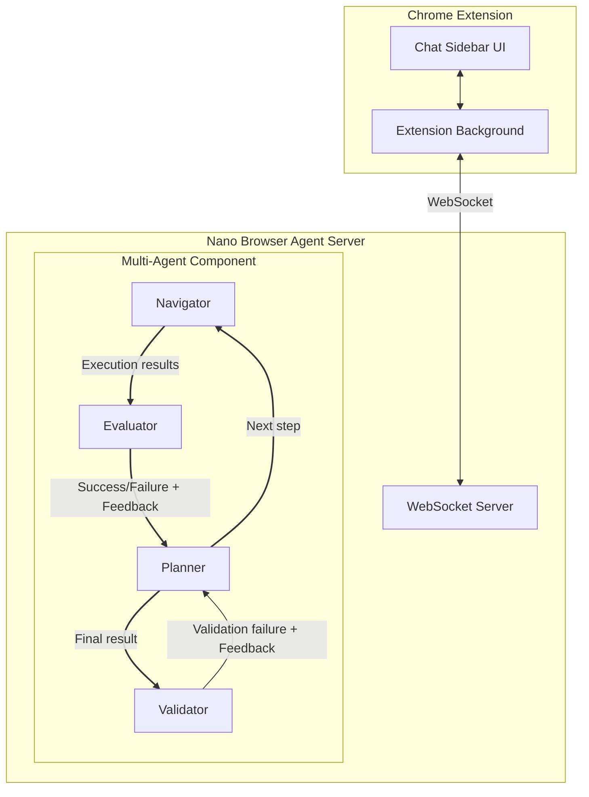

# NanoBrowser

Open source multi-agent browser automation tool with built-in Chrome extension.


## System Architecture

The system architecture is visualized using a mermaid diagram, illustrating the interaction between various components such as the Chrome Extension, WebSocket Server, and Multi-Agent components.



### Chrome Extension
- **Chat Sidebar UI**: User interface for interacting with the multi-agent system
- **Extension Background**: Handles WebSocket communication with the server

### WebSocket Server
- Manages bidirectional communication between the Chrome extension and the multi-agent system
- Relays commands and status updates between components

### Multi-Agent Component
- **Planner Agent**: Breaks down web navigation tasks into manageable steps
- **Navigator Agent**: Executes web navigation steps as planned
- **Evaluator Agent**: Assesses the success of each navigation step and provides feedback for retries (TODO)
- **Validator Agent**: Verifies overall task completion and results (TODO)


## Usage

### Prerequisites
- Chrome browser installed on your machine
- Use git to clone this repository or download the zip file and unzip it

### Install the Chrome Extension

To install the Chrome Extension:

1. Open Chrome and navigate to `chrome://extensions/`.
2. Enable "Developer mode" by toggling the switch in the top right corner.
3. Click "Load unpacked" button in the top left.
4. Select the `nanobrowser/extension/src` directory.
5. The extension should now appear in your Chrome toolbar.

### Run the NanoBrowser Agent Server via script (MacOS)

To run the NanoBrowser Agent Server via script (MacOS), follow these steps:

1. Navigate to the `nanobrowser` directory:
   ```bash
   cd nanobrowser
   ```
2. Run the installation script:
   ```bash
   ./install.sh
   ```
3. Run the NanoBrowser Agent Server:
   ```bash
   uv run nanobrowser
   ```

### Run the NanoBrowser Agent Server Manually

To run the NanoBrowser Agent Server manually on Linux/MacOS or Windows, follow these steps:

1. **Install `uv`**:
   - **Linux**: Open your terminal and run:
     ```bash
     curl -LsSf https://astral.sh/uv/install.sh | sh
     ```
   - **Windows**: For detailed installation instructions, please refer to the official documentation [here](https://docs.astral.sh/uv/getting-started/installation/).

2. **Create a Virtual Environment**:
   - Navigate to the `nanobrowser` directory:
     ```bash
     cd nanobrowser
     ```
   - Create a virtual environment:
     ```bash
     uv venv --python 3.10
     ```

3. **Install Dependencies**:
   - Install the required dependencies:
     ```bash
     uv pip install .
     ```

4. **Set Up Configuration**:
   - If a `config.yaml` file does not exist, copy the example configuration:
     ```bash
     cp config_example.yaml config.yaml
     ```
   - Edit `config.yaml` with your settings, including filling in the LLM API keys.

5. **Run the Project**:
   - Ensure you have Google Chrome installed and the Chrome extension loaded in developer mode.
   - Finally, run the NanoBrowser Agent Server:
     ```bash
     uv run nanobrowser
     ```

## Contributing

Contributions to the NanoBrowser project are welcome! To contribute:

1. **Fork the repository**.
2. **Clone your fork**.
3. **Create a new branch** for your feature or fix.
4. **Make your changes** and commit them.
5. **Push to your fork** and create a pull request.

Thank you for your interest in contributing to NanoBrowser!


## Acknowledgments

Special thanks to the open-source projects that inspired NanoBrowser:
- [python-cdp](https://github.com/HMaker/python-cdp)
- [Agent-E](https://github.com/EmergenceAI/Agent-E)
- [fuji-web](https://github.com/normal-computing/fuji-web)

Their foundational work helped shape this project. We appreciate the open-source community's collaborative spirit.

## License

This project is licensed under the [Apache License 2.0](https://github.com/alexchenzl/nanobrowser/blob/master/LICENSE) - see the [LICENSE](LICENSE) file for details.
